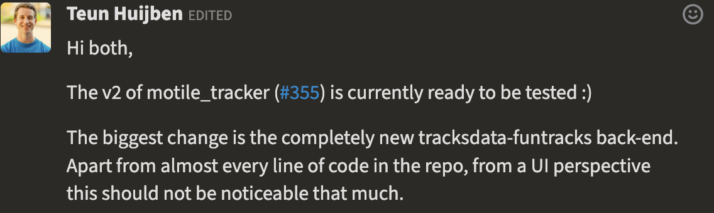
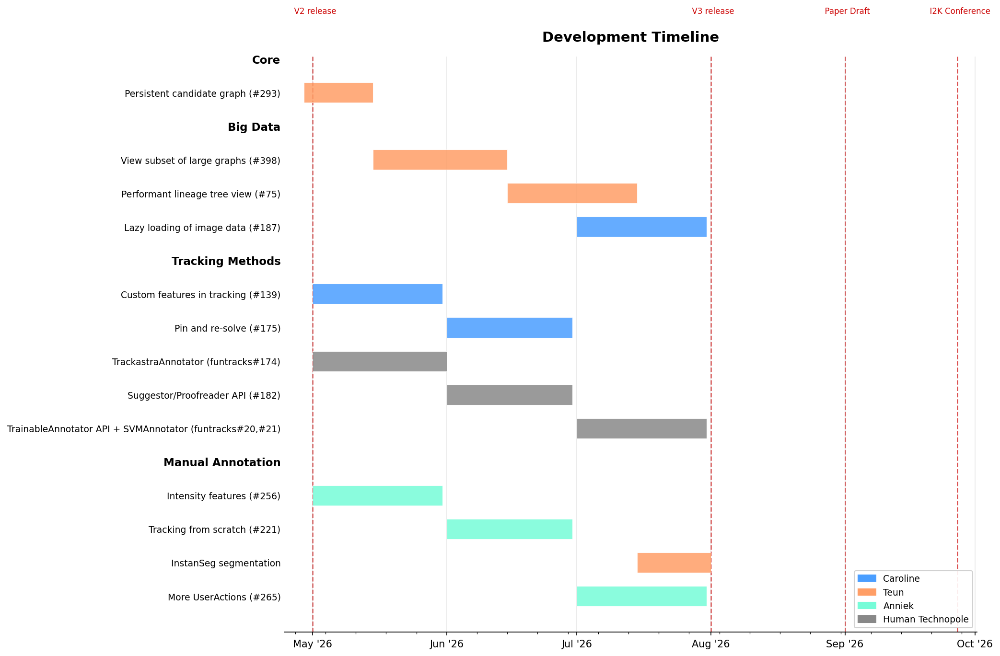

# Motile Tracker All-Hands Meeting

**Date:** April 29, 2026

## Attendees
- Caroline Malin-Mayor - HHMI Janelia Research Campus
- Teun Huijben - Biohub
- Anniek Stokkermans - Hubrecht Institute
- Jan Funke - Human Technopole
- Joran Pierre Deschamps - Human Technopole
- Milly Croft - Human Technopole
- Jakob Troidl - HHMI Janelia Research Campus

## Agenda

- [Recent Status Updates](#recent-status-updates)
- [Feature Priorities](#feature-priorities)
- [Concrete Next Steps](#concrete-next-steps)

## Status Updates

Advantages:
- In-memory and on-disk storage options for segmentations
- Ability to slice graphs by region, lineage, etc. and view subgraphs
Next step - make a single persistent candidate graph stored in SQL, edit that on user edits and solving, view solutions as a subset

## Feature Priorities
Categories:
- Manual annotation (Hubrecht)
- Learning from annotations (HT)
- Support for big datasets (Biohub)
- Tracking performance (HT?)
- ? - MIA

## Concrete Next Steps
Just a VERY ROUGH suggestion for what people will be working on next - so we are all aware of what's generally going on.

### Paper Discussion
I have discussed a Motile Tracker publication that focuses on the manual curation aspect with Teun and Jan independently.
We should have a separate meeting with Loic to nail down details.
The main relevant aspect for this meeting is the desire to separate the tracking methods from the UI curation tooling.
